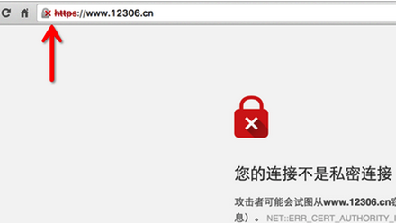
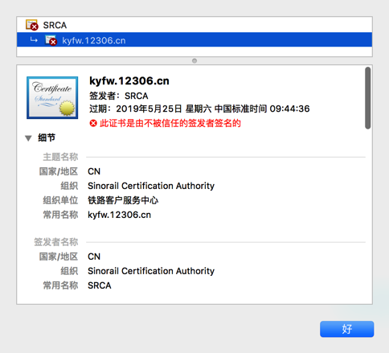

###二. JavaScript
####1.优化代码，提高可读性

####2.优化代码，达到预期输出
```
for (var i = 1; i <= 10; i++) {
    setTimeout((() => console.log(i))(i))
}
```
####3.请给出运行结果，并解释为什么
```
class Animal {
  constructor(pos) {
    this.pos = pos;
  }
}

class Whale extends Animal {
  constructor(pos) {
    super(pos + 1);
  }
  swim() {
    this.pos <<= 1;
    setTimeout(function timer() {
      this.pos <<= 1;
      this.pos < 8 && setTimeout(timer, 0);
      console.log(this.pos);
    }, 0);
    console.log(this.pos);
  }
}

var pos = 1;
const whale = new Whale(pos);
whale.swim();
```

1）显示结果4 ，2、4、8；
2）
###三. 开放性问题
###1.HTTPS 是安全的，那么
####1）保证了谁的安全？
超文本传输安全协议(HTTPS)是超文本传输协议和SSL/TLS的组合，保证了信息数据传递过程中的安全。
####2）适用哪些场景？
https应该用于任何场景！
针对：
（1）钓鱼网站？网站背后的公司是否可信？DNS劫持？DNS污染？
（2）运营商如果耍流氓搞http劫持你能怎么办？嵌入广告，或者整个拦截掉，甚至A公司的产品给你重定向到B公司页面。
####3）是否天衣无缝？如果不是，请提供一个场景和前提条件来攻破HTTPS。
#####中间人攻击
开发中难免遇到http抓包的需求，有时遇到https的请求，一般抓包方式就没法正确截获数据了。不过通过伪造证书，https的包也是可以抓的，参见iOS抓包利器Charles 。难道https如此脆弱？既然https能轻易被抓包，还要来干啥？
先看下原理，首先charles伪装成服务端和客户端通信，并同时伪装成客户端与服务器通信，充当中间角色，从而截获数据，如图：


这种方式起效的前提是代码关闭了证书验证：AFNetWorking中的allowInvalidCertificates，所以release时记得打开证书验证，这样伪造的证书就不被接受了。

好了，看起来安全了？等等，allowInvalidCertificates只是实现了拒绝不受信任的证书，注意，重点是信任，如果证书是受到信任的呢？虽然可能性有点小，不过假设有一个攻击者手上拥有一个受信任的证书，首先iPhone信任的证书包括一些预装的证书iOS 8 中可用的受信任根证书的列表，和用户自己安装的证书。那么即使开启了证书allowInvalidCertificates，中间人攻击依然能够发生。这时候就需要开启SSL Ping Mode了

AFNetWorking里通过AFURLConnectionOperationSSLPinningMode设置
原理是把证书打包或者公钥打包在APP中，在NSURLConnectionDelegate协议中的connection:willSendRequestForAuthenticationChallenge:中检测证书是否没被篡改。
到此为止，用户的信息基本能保证安全了，但是还是不提倡对接口做签名算法等处理，加大攻击者对接口的攻击难度，下面继续聊。

浏览器访问的安全
好，以上方法加工做的APP在公共WIFI下传输足够保证用户数据传输的安全了，那么非APP呢，例如浏览器会如何？
其实浏览器和APP差不多，也有类似的证书验证功能，例如我们访问 https://www.12306.com
会发现如图提示：



同样访问百度会是这样：

注意地址栏的锁头的颜色，这个很关键！关键！关键！重要的话说三遍，哈哈

和iOS一样，如果wifi要进行https中间人攻击（截获数据），就得伪造证书，然后浏览器就会产生提醒，所以为了安全起见，公用wifi下面请勿访问证书有问题的网站。特别是金钱敏感网站，例如支付宝，银行等。

你又会问，为啥我在家访问 https://www.12306.com 也是红色的？这就得说下证书的问题了，因为12306使用的CA证书是一个叫SRCA的，这个CA浏览器不信任。
具体又得说到浏览器验证网站证书有效性的过程了

引用知乎另一问题的答案：
第一步：Trusted CA向vendor厂商提供CA根证书。
第二步：Trusted CA给site提供站证书。
第三步：vendor厂商的浏览器在用https访问的时候会检查站证书的合法性。

chrome不信任SRCA，所以就锁就红了，



一句话总结是，绿色的基本可以安全访问，红色的建议留点心。

###2.你最喜欢的框架／语言
####1）是什么？为什么？
CSS，它可以将好的UI设计转化成吸引人的页面效果，看得到的美学东西本身就是一种享受
####2）如果允许你为它添加一项特性，你希望是什么？为什么？
（1）要是允许的话，我个人希望添加一个background-img的rotate属性；
（2）
####3）如果允许你从中删除一项特性，你希望是什么？为什么？
（1）

####3.你做过的最酷炫或倾注最多心血的项目是什么？向我们介绍一下
自己的个人网站nicolaszs.com
这是我自己的个人网站：
（1）涵盖了我学习前端过程中的一些项目，一些我个人在校学习期间做的课程设计、旅行照片以及我个人收集的一些网站；
（2）它是我前端学习的试验田，可以让我了解整个网站架设的粗略流程：从产品原型——>UI设计——>静态页面——>页面交互——>前后端数据交互——>网站性能优化等...；
（3）我可以一点一点的慢慢实现网站设计以及细节交互设计；

###4.你拥有怎样的性格？喜欢什么业余活动？期望加入怎样的团队？
####1）性格方面：
（1）做事踏实负责任，
（2）善于沟通交流；
（3）乐于接受和学习新事物；
（4）易于相处，可以逗逼，可以闷骚；
（5）喜欢整理东西
####2）业余活动
（1）读书（钟爱小说）；
（2）聊球，看球（各类球类运动都可以看），会打篮球；
（3）看电影（豆瓣观影800部，钟爱科幻片）；
（4）徒步闲逛（四处溜达）；
（5）整理东西
####3）期望加入的团队
（1）因为是前端新人，希望最好能找到一个人带；
（2）团队组成完善；
（3）UI设计师做出的东西至少不比我自己做的差；
（4）可以团队内转换角色；
（5）最好定期有技术交流和培训；
（6）五险一金是必须的
###5.有什么想对我们说的？
（1）感谢贵公司给我给我这次机会；
（2）我想